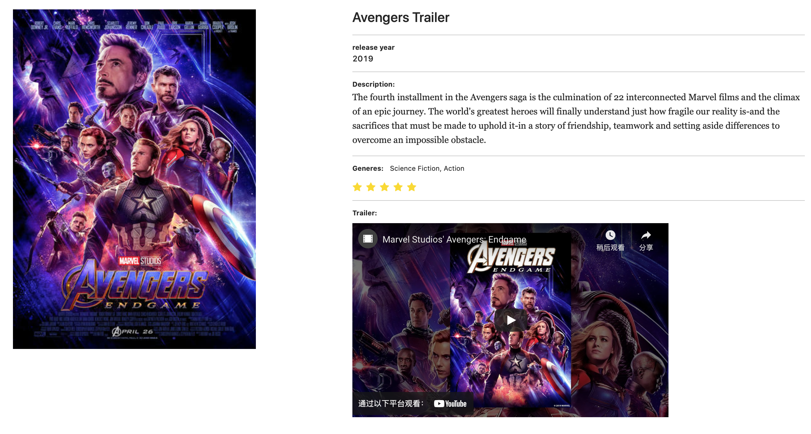
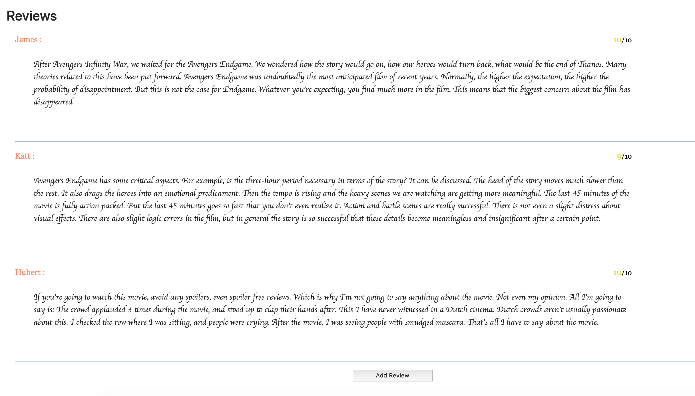
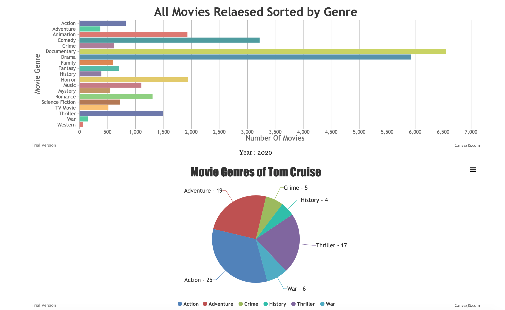
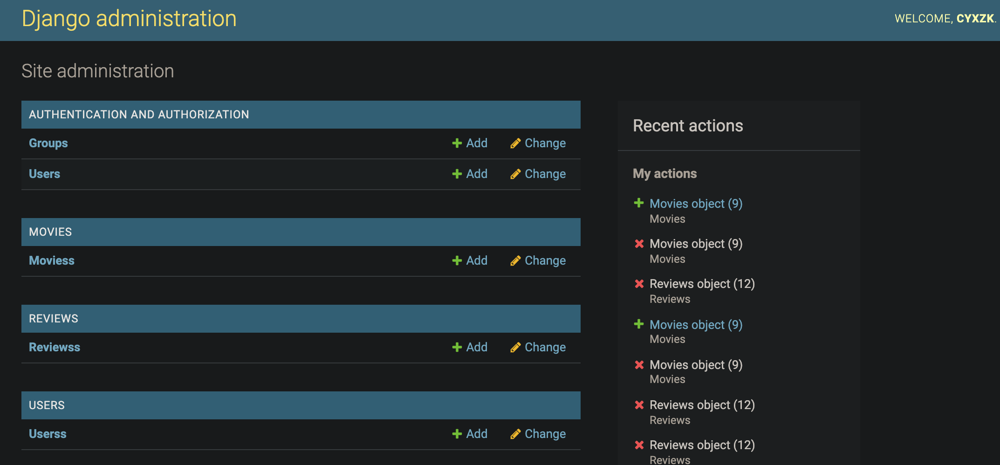
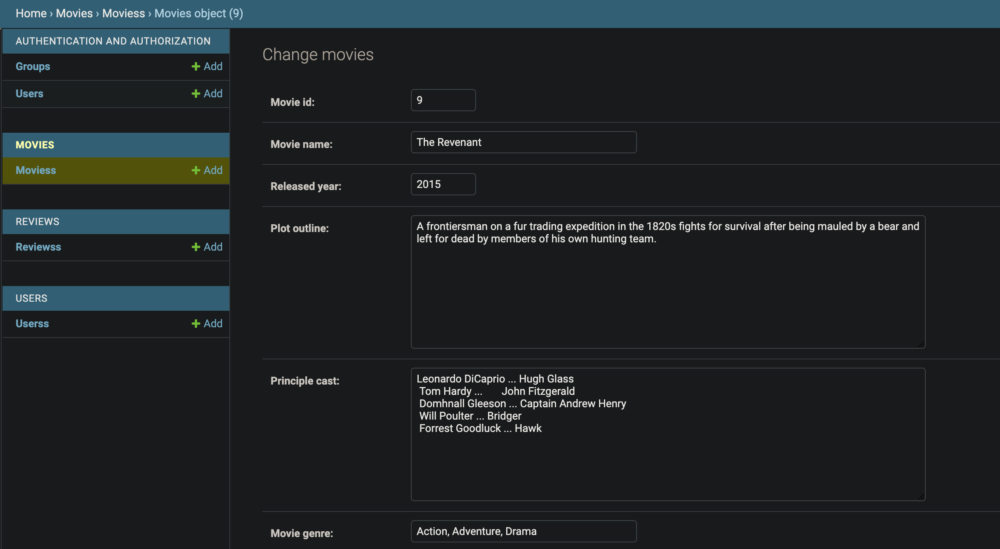

# Fenier
Movie Website

## Requirements

ReactJS

Django

mySQL

## Quick Start
1. Set virtual environment and install required packages

   ```
   pip install -r requirements.txt
   ```

   ```
   npm install
   ```

2. In "Fenier/Fenier/settings.py", modify "DATABASES" as your mysql configurations, then RUN

   ```
   python manage.py makemigrations && python manage.py migrate
   ```

3. Run 

   ```
   python manage.py runserver
   ```

## Presentation

















Youtube Link: https://www.youtube.com/watch?v=eyR5JNcHblo